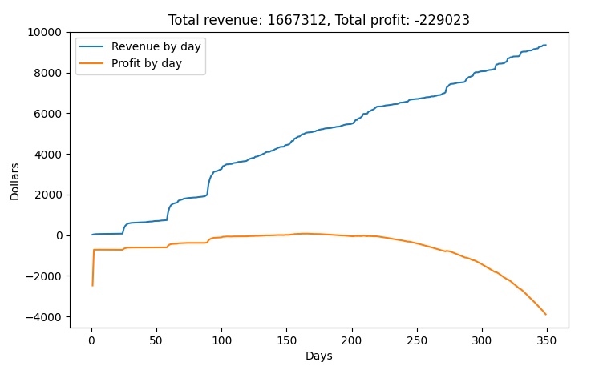

# Financial Forecasting   
To run the script first install the requirements with `pip install -r requirements.txt` and then run the script with `python financialModel.py`.  
  
## Overview   
    
|       Task |   Budget |
|:-----------|:---------|
| Operations | 1.25 mil |
|   Research |  0.4 mil |
|     Talent |  0.3 mil |
|       Misc | 0.05 mil |
|      Total |    2 mil |

The total budget allocation is displayed above. Each of the sections below goes into further detail for the operations, research, and talent uses of budget.    
## Product Operations   
The forecasting model works by the following:   
1. Creates a profile of number of new users over time (user acquisition curve)    
2. Creates statistical distributions for usage, indexing, storage, and searching   
3. Creates a profile of the use of indexing, storage, and searching over time   
4. Creates a profile of cost and revenue from use over time   
   
### User Aquisition   
The numbers used to determine how we gain users don't come from thin air. We used out LinkedIn account data as a benchmark for our performance through post impressions and visitor metrics which roughly follows an exponential decay after a post. As a result, the script accepts a list of dates and expected number of new users and applies exponential decay to the values to come up with the total number of users by day.   
```
# Given: Start date, End Date [[(Date), predicted signups], [], ...]
start_date = (2024, 6, 17)  # not included in analysis
end_date = (2025, 6	, 1)
user_aquisition_dates = [[(2024, 6, 18), 100], [(2024, 7, 12), 1000], [(2024, 8, 15), 1500], [(2024, 9, 15), 2000]]
```
The values above will generate the following chart:   
    
### Statistical Distributions   
No user is the same and no use is the same and we want to account for that in our analysis. Therefore, we created statistical distributions for each quality that a user may have. The four qualities of a user in this model include:   
1. Usage: How often a user uses the application   
2. Indexing: How many minutes a user indexes per use   
3. Storage: How many gigabytes of data are stored per use   
4. Searching: How many searches does a user make per use   
   
The term per "use" is used for items (2), (3), and (4). Every user is given a usage score from item (1). This determines how likely the user will use the software for every day since the users creates their account. The usage score is from 0 to 1 and follows the distribution:   
    
Which is skewed farther to low use than more use and has an average usage score of 0.1. The following three attributes of indexing, storage, and searching are considered to be independent of each other and all have their own distribution:   
    
Average indexing length: 4min   
    
Average storage size: 3Gb   
    
Average number of searches: 15   
### Usage Over Time   
We can use the distributions and logic presented above to create the following plot:   
    
Where each of the three aspects, indexing, storage, and search are in the in the units of minutes, gigabytes, and count respectively.   
## Cost Over Time   
The use over time chart can be supplemented by the cost of each action to make the cost over time chart. The cost for each action is:   
```
cost_per_min_indexed = 0.04  #Includes captioning 
cost_per_gb_uploaded = 0.023/30
cost_per_search = 0.0017 
base_cost_per_day = 15.6 

```
Making the total cost come out to:   
    
## Research   
The primary cost for research purposes are to train out own models. We have estimated the cost of training models over the number of epochs. We have allocated a total of 400,000 dollars to training our future gen AI model.   
    
## Talent   
We intend on hiring new talent for a total of 2 to 3 new hires for a total of a 4 to 5 person team. A break down of our intended team and salaries are below. We can allocated a total of 300,000 dollars to talent.   
|                                    Position |         Person |    Comp |
|:--------------------------------------------|:---------------|:--------|
|                                   Cofounder | Harsha Gundala |  75,000 |
|                                   Cofounder | Ganesh Pimpale |  75,000 |
|              Front End/Full Stack Developer |      Dany Boza |  75,000 |
| Misc (benefits, short-term employees, etc.) |            N/A |  75,000 |
|                                       Total |                | 300,000 |

Which can be plotted over a one year runway:   
    
## Summary   
The total costs from operations, research, and talent over time come out to be:   
    
    
When running this model with while charging 6 cents per minute of footage, we can get an estimate for the revenue generated and the total losses incurred.    
    
However, we expect the losses incurred over the course of a year with 10,000 users to be between 500,00 to 200,000 dollars.   
   
The breakdown of all the entire budget for a one year runway is:   
    
   
   
    
    
    
    