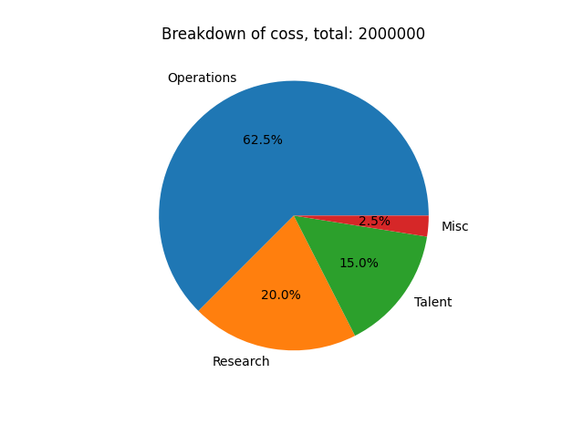
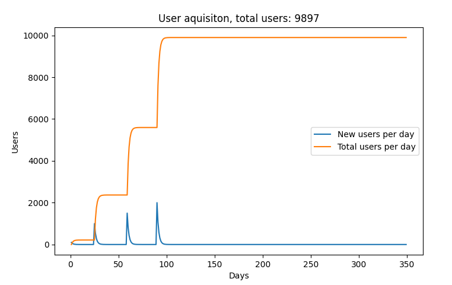
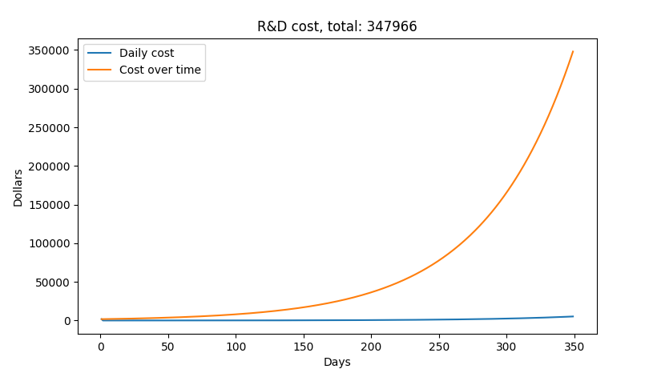

# Pre Seed Financial Report   
# Overview   
All the code to generate this report can be found: [https://github.com/distillmoonshine/fInancial-forecasting](https://github.com/distillmoonshine/fInancial-forecasting)    
    
|       Task |   Budget |
|:-----------|:---------|
| Operations | 1.25 mil |
|   Research |    1 mil |
|     Talent |  0.5 mil |
|       Misc | 0.25 mil |
|      Total |    3 mil |

The total budget allocation is displayed above. Each of the sections below goes into further detail for the operations, research, and talent uses of budget.    
# Product Operations   
The forecasting model works by the following:   
1. Creates a profile of number of new users over time (user acquisition curve)    
2. Creates statistical distributions for usage, indexing, storage, and searching   
3. Creates a profile of the use of indexing, storage, and searching over time   
4. Creates a profile of cost and revenue from use over time   
   
## User Aquisition   
The numbers used to determine how we gain users don't come from thin air. We our LinkedIn account data as a benchmark for our performance through post impressions and visitor metrics as shown below:   
    
    
    
   
This allows us to make the assumption that after a post or launch interest in Moonshine reduces by an exponential delay function. The data we got from LinkedIn is what we used for this financial model.   
   
The code accepts a list of dates and expected number of new users and applies exponential decay to the values to come up with the total number of users by day.   
```
# Given: Start date, End Date [[Date, predicted signups], [], ...]
start_date = (2024, 6, 17)  # not included in analysis
end_date = (2025, 6	, 1)
user_aquisition_dates = [[(2024, 6, 18), 100], [(2024, 7, 12), 1000], [(2024, 8, 15), 1500], [(2024, 9, 15), 2000]]
```
The values above will give the following chart:   
    
## Statistical Distributions   
No user is the same and no use is the same and we want to account for that in our analysis. Therefore, we created statistical distributions for each quality that a user may have.    
1. Usage: How often a user uses the application   
2. Indexing: How many minutes a user indexes per use   
3. Storage: How many gigabytes of data are stored per use   
4. Searching: How many searches does a user make per use   
   
   
The term per use is used for items 2, 3, and 4. This refers for the logic:   
```
def predict_usage(self):
    step_useage_thresh = self.sample_usage_thresh()
    for user_id in self.user_ids:
        if self.user_data[user_id, 1] >= step_useage_thresh:
            self.user_data[user_id, 2] += self.sample_user_index_distribution(1)[0]
            self.user_data[user_id, 3] += self.sample_user_storeage_distribution(1)[0]
            self.user_data[user_id, 4] += self.sample_user_search_distribution(1)[0]
```
Where the `self.sample\_usage\_thresh()` samples from a normal distribution. On the other hand, the user's usage distribution is:   
    
Which is skewed farther to low use than more use and has an average usage score of 0.1. The following three attributes of indexing, storage, and searching are considered to be independent of each other and all have their own distribution:   
    
Average indexing length: 4min   
    
Average storage size: 3Gb   
    
Average number of searches: 15   
## Usage Over Time   
We can use the distributions and logic presented above to create the following plot:   
    
Where each of the three aspects, indexing, storage, and search are in the in the units of minutes, gigabytes, and count respectively.   
## Cost Over Time   
The use over time chart can be supplemented by the cost of each action to make the cost over time chart. The cost for each action:   
```
cost_per_min_indexed = 0.04  #Includes captioning 
cost_per_gb_uploaded = 0.023/30
cost_per_search = 0.0017 
base_cost_per_day = 15.6 

```
Making the total cost come out to:   
    
   
# Research   
   
# Talent   
We intend on hiring new talent for a total of 2 to 3 new hires for a total of a 4 to 5 person team. A break down of our intended team and salaries are below:   
|                       Position |         Person |    Comp |
|:-------------------------------|:---------------|:--------|
|                      Cofounder | Harsha Gundala |  75,000 |
|                      Cofounder | Ganesh Pimpale |  75,000 |
| Front End/Full Stack Developer |      Dany Boza | 100,000 |
|                    AI/ML Infra |            TBD | 150,000 |
| Misc (bonuses, benefits, etc.) |            N/A |  50,000 |

   